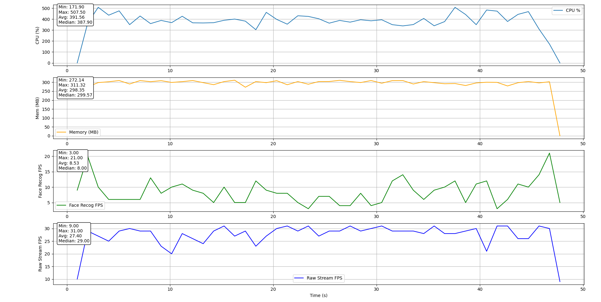
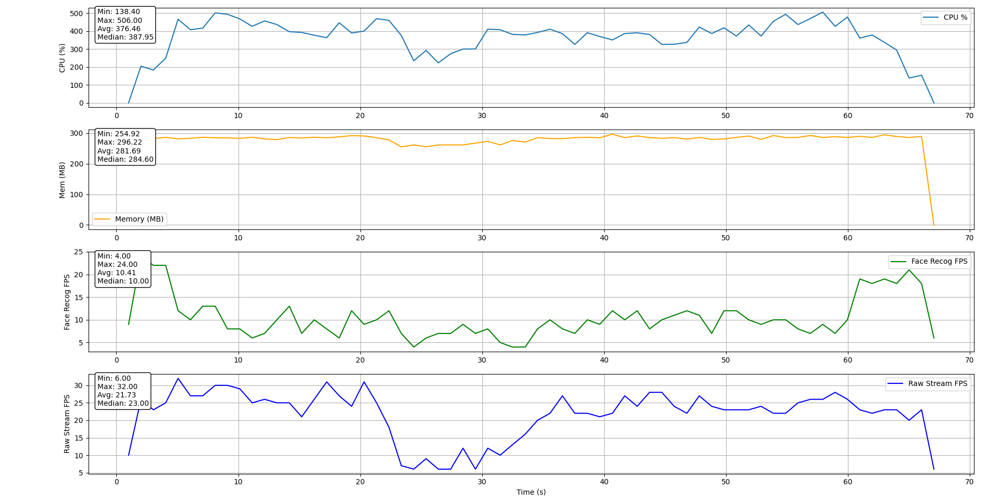
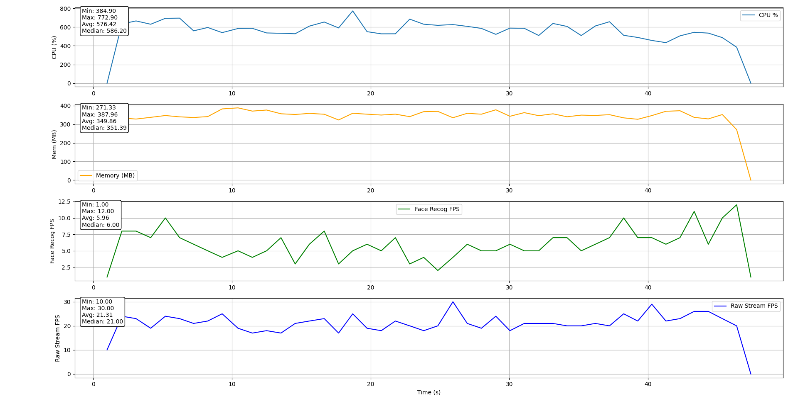

# Computer Vision Performance Comparison

A simple comparison between different programming languages and libraries for a basic computer vision task.

- 8 concurrent streams processed in parallel on different threads
- 3 of them are processed by face recognition (using default OpenCV Haar Cascades) and displayed
- 5 of them are just displayed
- The streams are MJPEG streams using YUV420P pixel format
- After every frame, a system call (writing the stream id to stdout) is executed - to simulate a real-world scenario

# Implementations

- **C++ (GStreamer)** - using GStreamer for video capture and OpenCV for face recognition
- **C++ (OpenCV, FFMpeg)** - using OpenCV (with FFMpeg) for video capture and for face recognition
- **Python (OpenCV)** - using OpenCV (with FFMpeg) for video capture and face recognition

# Results

> Taking the average

| Performance metric | C++ (GStreamer) | C++ (FFMpeg)                                        | Python (OpenCV) |
| ------------------ | --------------- | --------------------------------------------------- | --------------- |
| CPU Usage          | 392% (+ 4%)     | **376%**                                            | 576% (+ 53%)    |
| Memory Usage       | 298 MB (+ 6%)   | **282 MB**                                          | 350 MB (+ 24%)  |
| FPS - face recog.  | **9 FPS**       | 10 FPS (but a huge delay, therefore GStreamer wins) | 6 FPS (- 33%)   |
| FPS - raw stream   | **27 FPS**      | 22 FPS (- 18%)                                      | 21 FPS (- 22%)  |

## Analysis

- **C++ (GStreamer)** is clearly the winner here.
- **C++ (FFMpeg)** is also a good choice, but I encountered a huge stream delay when using it.
- **Python (OpenCV)** is the slowest, but gives very decent results.

When it comes to developer experience, Python is the clear winner. It's much easier to write and debug code in Python than in C++.

Overall, if I had to choose, I'd go with C++ (GStreamer) for a production environment, and Python for a quick prototype.

# Results - Detailed

## Per language

### C++ (GStreamer)



### C++ (FFMpeg (OpenCV Video Capture))



### Python (FFMpeg/OpenCV Video Capture)



## Comparison

### CPU Usage


- lower = better
- 100% = 1 core (so e.g. 200% = 2 cores)

### Memory Usage


- lower = better

### FPS - face recognition


- higher = better

### FPS - raw stream


- higher = better

# Steps to test

## Before you start

1. Before running the code, make sure you have the following libraries installed:

- [OpenCV](https://opencv.org/)
- [Gstreamer](https://gstreamer.freedesktop.org/)

2. Create a Python venv and install the Python dependencies:

```bash
python -m venv venv

# For Unix (Linux, macOS)
source venv/bin/activate

# For Windows
venv\Scripts\activate

pip install -r requirements.txt
```

3. Make sure you have a MJPEG stream URL to test the code with.
   You can use a free Android app called "IP Webcam" to create a stream from your phone's camera.

For example, a stream URL can look like this: `http://192.168.0.251:8080/video`

Make sure to replace the `<stream_url>` placeholder with your stream URL in the commands below.

## C++

> Important: Use an external terminal (i.e. not the one integrated in your IDE, you can e.g. use normal Command Prompt). It didn't work for me when I tried to use the VSCode terminal.

1. Open the terminal in the `exampleCpp` directory
2. Build the project with CMake:

```bash
mkdir build
cd build
cmake ..
make
```

3. Go back to the root directory:

```bash
cd ..
```

4. Run the measure script

```
python measure.py ./exampleCpp/out/build/x64-release/exampleCpp.exe <stream_url>
```

e.g.

```
python measure.py ./exampleCpp/out/build/x64-release/exampleCpp.exe http://192.168.0.251:8080/video
```
